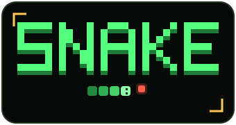
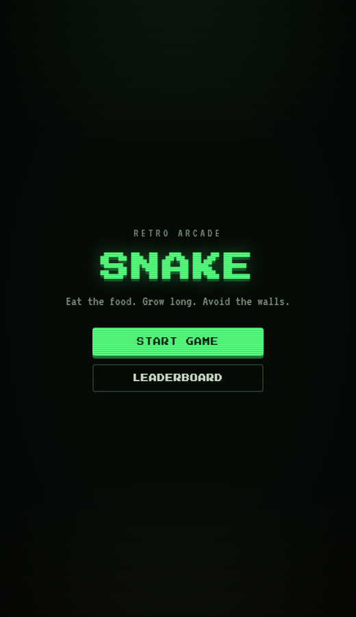
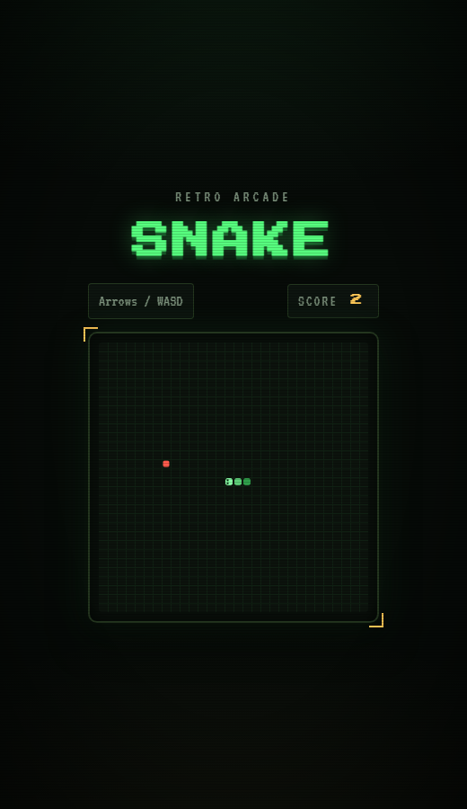
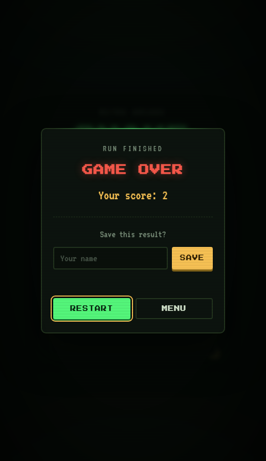
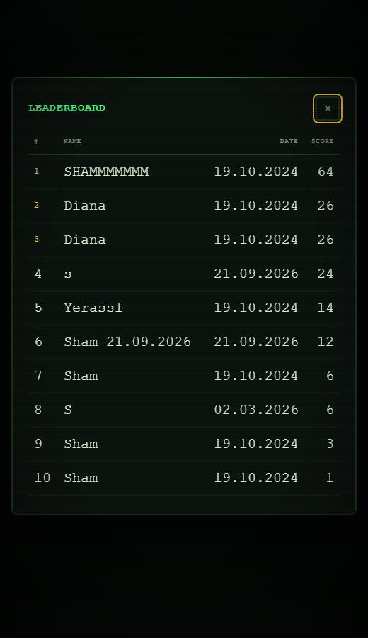
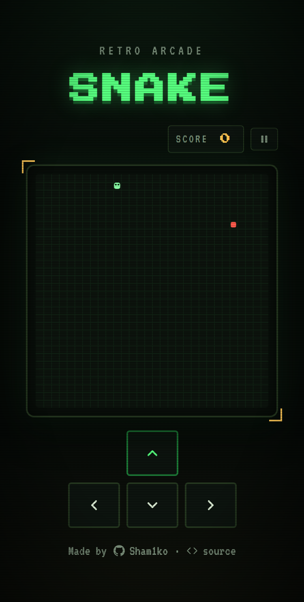

<div align="center">
  
  <p>Classic snake for the browser, written in vanilla JavaScript.</p>
</div>

## Screenshots

<table>
  <tr>
    <td align="center"><br /><sub>Menu</sub></td>
    <td align="center"><br /><sub>Gameplay</sub></td>
  </tr>
  <tr>
    <td align="center"><br /><sub>Game over</sub></td>
    <td align="center"><br /><sub>Leaderboard</sub></td>
  </tr>
  <tr>
    <td align="center" colspan="2"><br /><sub>Mobile, button controls</sub></td>
  </tr>
</table>

## Tech stack

- Canvas 2D draws the board at 600x600 device pixels and displays it at 300 CSS pixels, so shapes stay sharp on high-density screens.
- Vanilla JavaScript with ES modules. The game has no dependencies and no build step.
- CSS custom properties hold the color palette. Scanlines, the vignette, and pixel-style buttons are plain CSS overlays.
- Touch input: swipe gestures on the board and an optional on-screen D-pad, chosen in the menu on touch devices.
- A Cloudflare Worker stores the leaderboard. The client talks to it with fetch.

## Project files

| File | What it does |
| ---- | ------------ |
| `game.js` | game loop, collisions, canvas rendering |
| `ui.js` | DOM updates, screen switching, leaderboard states |
| `index.js` | event wiring, save and fetch calls |
| `index.html` | page skeleton, overlays, font links |
| `style.css` | the whole theme |

## Run the game

ES modules need HTTP, so serve the folder instead of opening the file directly.

```sh
npx serve .
```

or

```sh
python -m http.server 8000
```

Then open http://localhost:3000 or http://localhost:8000.

## Controls

Keyboard: steer with the arrow keys or WASD. The keys work on any keyboard layout.

Touch: pick the control scheme in the menu before starting. Swipe anywhere on the board, or switch to the on-screen D-pad. The choice is remembered between visits. On a desktop without a touchscreen the picker stays hidden and the keyboard rules.

Pause: press the button next to the score, or Escape. The game freezes completely while paused. The tab also auto-pauses when it goes to the background. Escape closes the leaderboard, and on the game over screen it returns to the menu.

## Leaderboard API

The client reads and writes scores at `https://snake-game-worker.shamshyrak-zholdasbek.workers.dev`.

- `GET` returns the saved scores as a JSON array. The client renders the first 10 entries.
- `POST` saves one result. The body is JSON: `{ "name": "Ada", "score": 12 }`.
